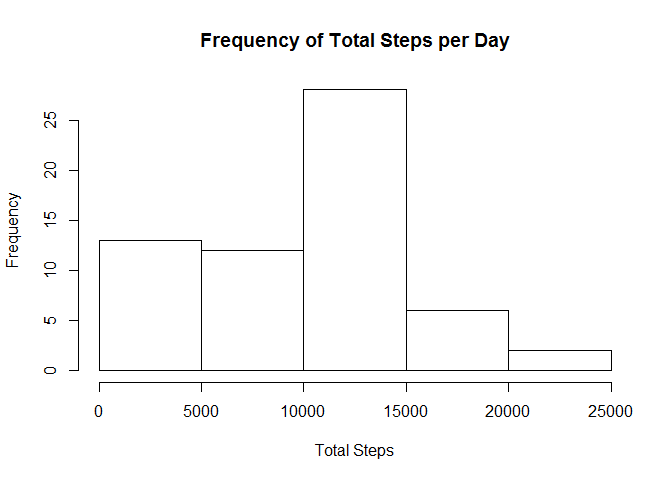
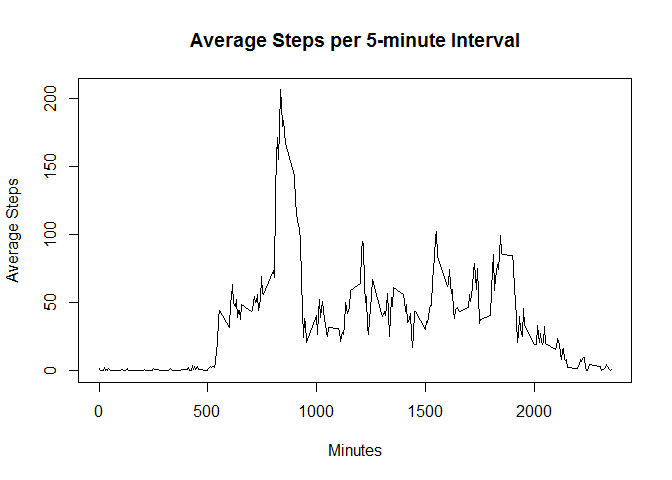
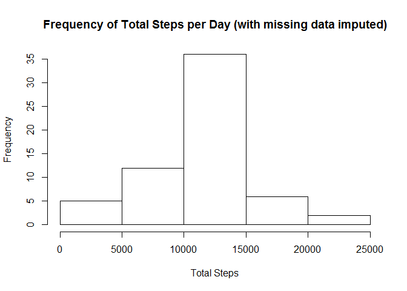
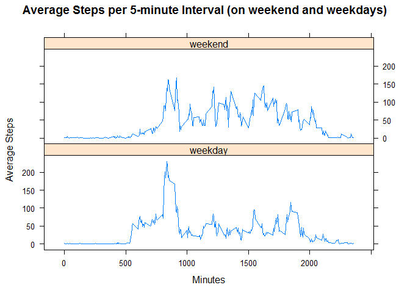

# Reproducible Research: Peer Assessment 1

## Loading and preprocessing the data

Download and unzip the [Activity monitoring data](https://d396qusza40orc.cloudfront.net/repdata%2Fdata%2Factivity.zip) into the working directory or obtain the same dataset from this GitHub repository.

Then, use the following code chunk to read the local file into R:


```r
activity <- read.csv("activity.csv")
```

Load the packages required for analysis


```r
library(dplyr)
library(lattice)
```

## What is mean total number of steps taken per day?

Calculate the total number of steps taken per day (ignoring missing values)


```r
total <- activity %>% group_by(date) %>% summarize(totalsteps=sum(steps, na.rm=TRUE))
```

Make a histogram of the total number of steps taken each day


```r
hist(total$totalsteps, xlab="Total Steps", main="Frequency of Total Steps per Day")
```

 

Calculate and report the mean (rounded) and median of the total number of steps taken per day


```r
mean <- round(mean(total$totalsteps))
median <- median(total$totalsteps)
```

* The **mean** of the total number of steps taken per day is **9354**.  
* The **median** of the total number of steps taken per day is **10395**.

## What is the average daily activity pattern?

Calculate the average number of steps taken per interval (averaged across all days)


```r
average <- activity %>% group_by(interval) %>% summarize(averagesteps=mean(steps, na.rm=TRUE))
```

Make a time series plot of the 5-minute interval and the average number of steps taken


```r
with(average, plot(interval, averagesteps, type="l", xlab="Minutes", ylab="Average Steps",
                   main="Average Steps per 5-minute Interval"))
```

 

Calculate and report the 5-minute interval with the maximum number of steps (on average across all the days in the dataset)


```r
minutemax <- filter(average, averagesteps==max(averagesteps))
minute <- minutemax$interval
max <- round(minutemax$averagesteps)
```

* The interval at **835** minutes has the maximum number of average steps of **206**.

## Imputing missing values

Calculate and report the total number of missing values in the dataset


```r
missing <- sum(is.na(activity))
```

* The total number of rows with **NAs** is **2304**.

Create a new dataset where the missing values have been replaced with the mean for that given 5-minute interval


```r
complete <- mutate(activity, steps=ifelse(!is.na(steps), steps, average$averagesteps))
```

Calculate the total number of steps taken per day (with missing values replaced)


```r
total2 <- complete %>% group_by(date) %>% summarize(totalsteps=sum(steps))
```

Make a histogram of the total number of steps taken each day


```r
hist(total2$totalsteps, xlab="Total Steps", main="Frequency of Total Steps per Day (with missing data imputed)")
```

 

Calculate and report the mean and median of the total number of steps taken per day


```r
options(scipen=999)
mean2 <- round(mean(total2$totalsteps))
median2 <- round(median(total2$totalsteps))
```

* The **mean** of the total number of steps taken per day is **10766**.  
* The **median** of the total number of steps taken per day is **10766**.

Calculate the difference in mean and median between the original and imputed datasets


```r
meandiff <- mean2-mean
mediandiff <- median2-median
```

**Conclusion**: When missing values in the original dataset were replaced with average estimates for that 5-minute interval, the mean total number of steps taken per day changed by **1412** and the median shifted by **371** steps.  Also, it is not surprising that the median (the middle number) would now approximate the mean.

## Are there differences in activity patterns between weekdays and weekends?

Create a new factor variable in the complete dataset with two levels indicating whether a given date is a weekday or weekend


```r
days <- mutate(complete, days=ifelse(weekdays(as.Date(date)) %in% c("Saturday","Sunday"), "weekend", "weekday"))
```

Calculate the average number of steps taken per interval (averaged across all weekdays or weekend days)


```r
average2 <- days %>% group_by(interval, days) %>% summarize(averagesteps=mean(steps))
```

Make a panel plot containing a time series of the 5-minute interval and the average number of steps taken


```r
xyplot(averagesteps ~ interval | days, average2, layout=c(1,2), type="l", xlab="Minutes", ylab="Average Steps",
                   main="Average Steps per 5-minute Interval (on weekend and weekdays)")
```

 

**Conclusion**: The activity patterns for weekdays and weekends appear to be different.  There are more steps taken in the earlier hours of the weekdays and a higher amount throughout the rest of the weekend hours.
